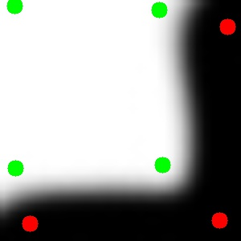
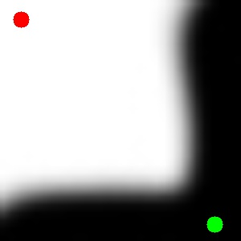
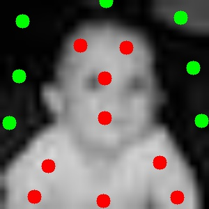

# Image Segmentation

## Usage
``` 
python imagesegmentation.py filename
```

A new window will pop up showing your image. Use your cursor to mark object seeds, which would be shown in red. Once you're done, press `esc`. Then do the same to mark background seeds, which would be shown in green.

## Dependencies

- Python 2
- OpenCV 3.3
- NumPy

## Examples

1. `test1.jpg` 

Original, seeded, and segmented image
<<<<<<< HEAD
 
=======

  
>>>>>>> e0ac13679ac98aa83f8ee1db6202c20ae3a7f494

2. `test2.jpg`

Original, seeded, and segmented image


3. `test3.jpg`

Original, seeded, and segmented image


4. `baby.jpg`

Original, seeded, and segmented image



## To dos

- Add other graph cut algorithms
- Optimize it so it can run in reasonable time for small images (as of right now it can only work fast enough for 30 x 30 images)
- Stretch goal: make a web app


