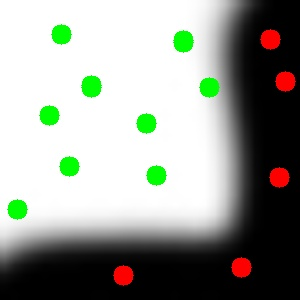
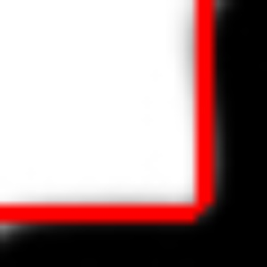
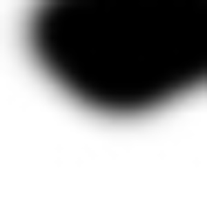
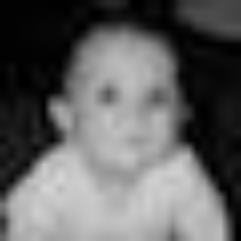

# Image Segmentation

## Website

For detailed description, please visit https://julie-jiang.github.io/image-segmentation/. 

## Usage
``` 
python imagesegmentation.py filename
```

A new window will pop up showing your image. Use your cursor to mark object seeds, which would be shown in red. Once you're done, press `esc`. Then do the same to mark background seeds, which would be shown in green.

## Dependencies

- Python 2
- OpenCV 3.3
- NumPy

## Examples

1. `test1.jpg` 

Original, seeded, and segmented image

  

2. `test2.jpg`

Original, seeded, and segmented image


3. `test3.jpg`

Original, seeded, and segmented image




4. `baby.jpg`

Original, seeded, and segmented image




